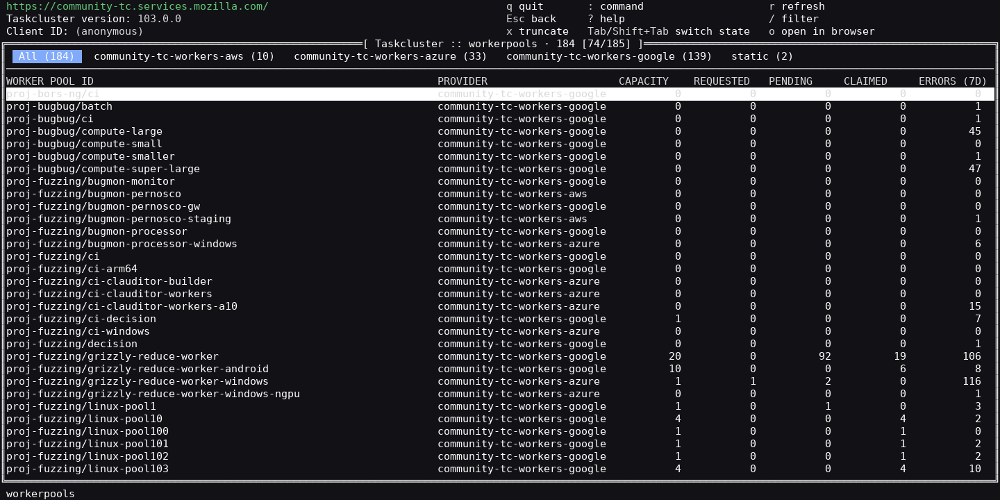
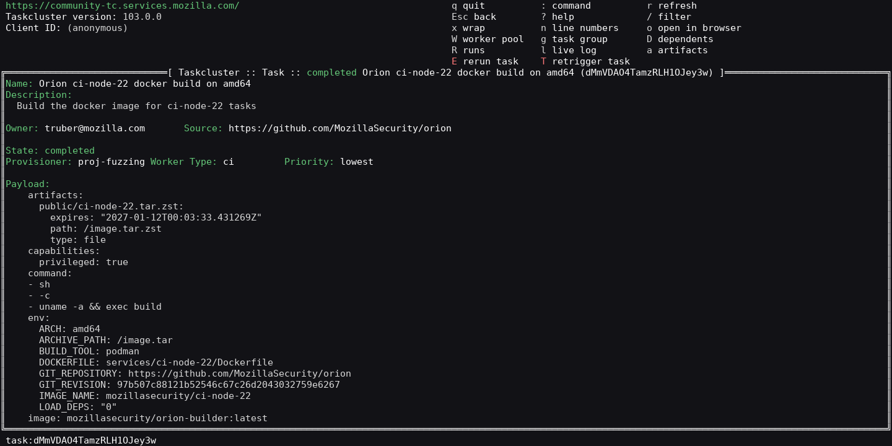
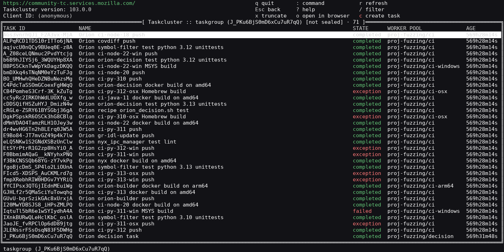
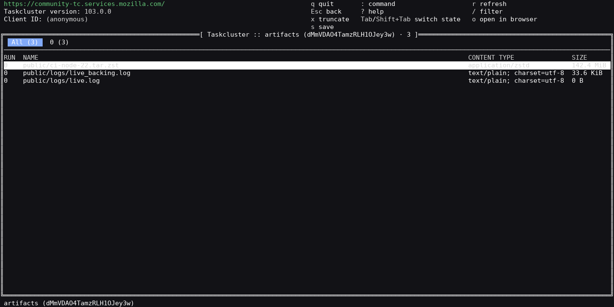
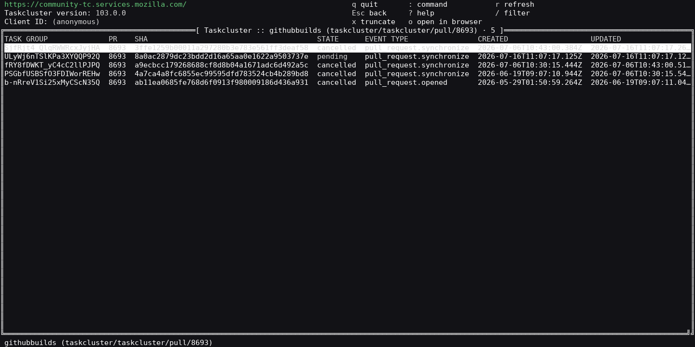
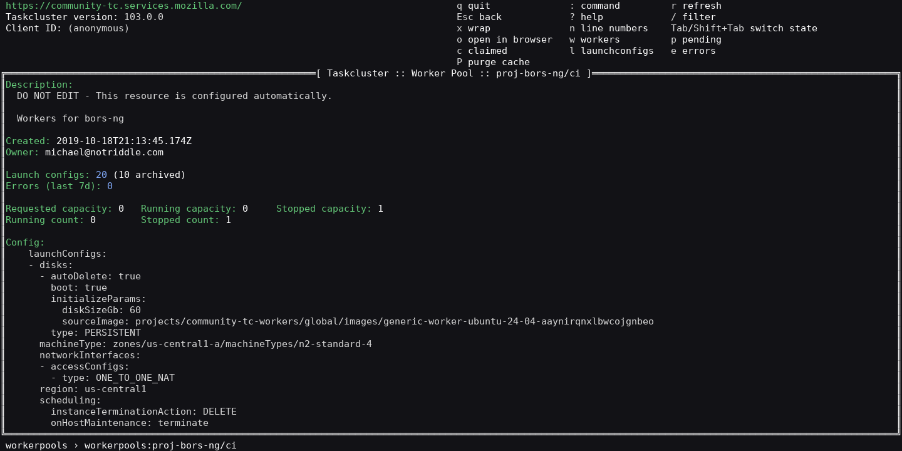
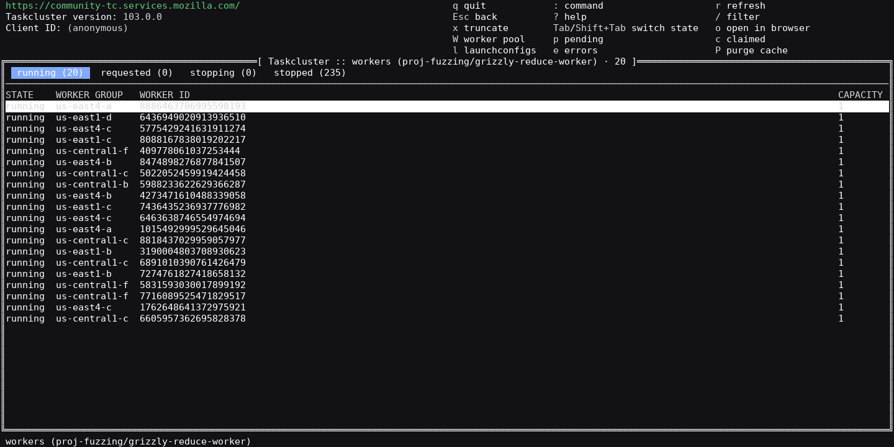
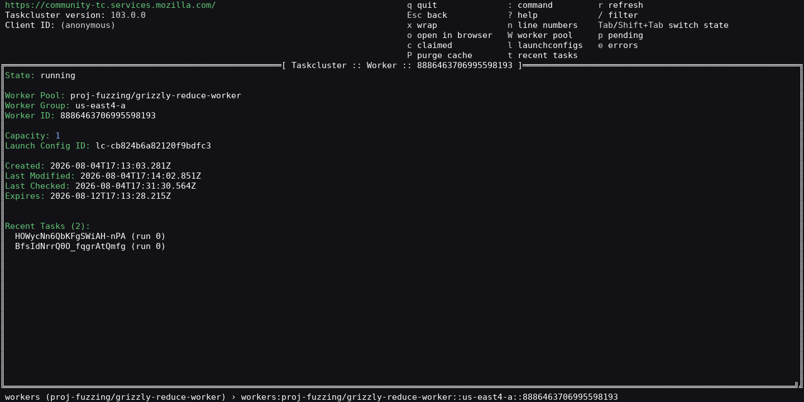
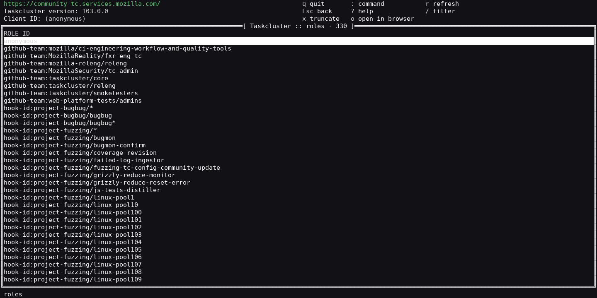
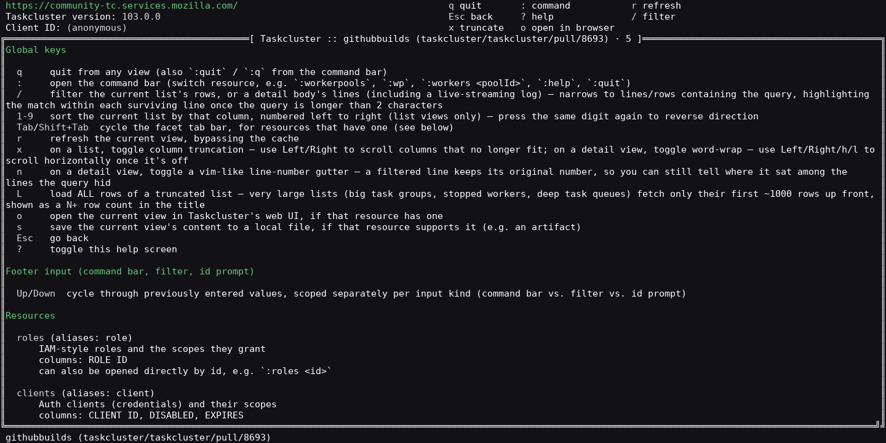

# tc-tui

A terminal UI for [Taskcluster](https://taskcluster.net), Mozilla's CI/task execution platform. Browse and act
on Taskcluster entities — worker pools, workers, tasks, task groups, artifacts, roles, clients, secrets, hooks,
GitHub builds and more — without leaving the terminal. Navigation is command-bar driven, in the spirit of
`vim`/`k9s`.



## Install / build

Requires Go 1.26+.

```sh
go build .                 # produces ./tc-tui
go run .
```

## Run

`tc-tui` needs `TASKCLUSTER_ROOT_URL` set — it panics on startup otherwise, since the Taskcluster client SDK is
initialized via `NewFromEnv()`:

```sh
export TASKCLUSTER_ROOT_URL=https://community-tc.services.mozilla.com/
go run .
```

Optional credential env vars (`TASKCLUSTER_CLIENT_ID`, `TASKCLUSTER_ACCESS_TOKEN`, etc.) enable authenticated
calls (creating tasks, viewing secrets, ...). Without them the app runs anonymously — most read-only resources
on public instances (like community-tc) are still browsable.

You can jump straight to a view instead of the default/last session by passing positional args, the same way
`:name scope` would in the command bar:

```sh
tc-tui                              # resume the last session (or worker pools)
tc-tui wp proj-taskcluster/ci       # open that worker pool directly
tc-tui pending proj-taskcluster/ci  # open its pending tasks
tc-tui task <taskId>                # open a task directly
tc-tui --help                       # full key + resource reference (no root URL needed)
tc-tui --version                    # client version and build hash
```

The view stack is persisted across restarts, so `tc-tui` reopens wherever you left off.

## Usage

Open the command bar with `:` and type a resource name or alias (`:wp`, `:workers <poolId>`, `:task <id>`,
`:help`, `:quit`). Move with `j`/`k` or the arrows, `Enter` to drill in, `Esc` to go back.

| Key | Action |
|---|---|
| `:` | command bar — switch resource, e.g. `:workerpools`, `:wp`, `:workers <poolId>`, `:quit` |
| `/` | filter the current list's rows, or a detail body's lines (including a live-streaming log), highlighting the match |
| `1`-`9` | sort the current list by that column, numbered left to right (press again to reverse) |
| `Tab` / `Shift+Tab` | cycle the facet tab bar, for resources that have one (e.g. worker pools by provider, workers by state) |
| `j`/`k`, arrows | move selection / scroll |
| `Enter` | drill into the selected row |
| `r` | refresh the current view, bypassing the cache |
| `x` | on a list, toggle column truncation (then `←`/`→` to scroll columns); on a detail, toggle word-wrap |
| `n` | on a detail view, toggle a vim-like line-number gutter |
| `L` | load ALL rows of a truncated list (large lists fetch ~1000 rows up front, shown as `N+` in the title) |
| `o` | open the current view in Taskcluster's web UI, if it has one |
| `s` | save the current view's content to a local file, if supported (e.g. an artifact) |
| `Esc` | go back |
| `?` | toggle the in-app help screen (full, always-up-to-date resource/key reference) |
| `q` | quit (also `:quit` / `:q`) |

In the footer input (command bar, filter, id prompt), `Up`/`Down` cycle through previously entered values,
scoped separately per input kind.

Detail views expose their own context keys as header hints — e.g. a task offers `E` rerun, `T` retrigger, plus
cancel/priority actions, `l` live log, `a` artifacts, `R` runs, `D` dependents; a worker pool offers `w`
workers, `p` pending, `c` claimed, `l` launch configs, `e` errors, `P` purge cache.

## Resources

Addressed by name or alias in the command bar. Press `?` inside the app for the full list with each resource's
columns and required scope.

**Auth & secrets**
- `roles` (`role`) — IAM-style roles and the scopes they grant
- `clients` (`client`) — auth clients (credentials) and their scopes
- `secrets` (`secret`) — secret names and their values (fetched on open)

**Hooks**
- `hooks` (`hook`) — scheduled/triggered task templates across all hook groups
- `hookfires` (`fires`) — a hook's recent fires; select one to jump to its task

**Worker pools & workers**
- `workerpools` (`wp`, `pools`) — provisioning config: provider, capacity, pending/claimed/error counts (faceted by provider)
- `workers` (`w`) — individual workers in a pool (faceted by state: running/requested/stopping/stopped)
- `recenttasks` — a worker's recent tasks
- `launchconfigs` (`lc`, `configs`) — launch configurations for a pool (active/all)
- `errors` (`err`) — provisioning errors reported for a pool
- `purgecache` (`purge`, `cache`) — open cache-purge requests for a pool

**Tasks**
- `task` — a single task by id: definition, state, payload, runs, and rerun/retrigger/cancel/priority actions
- `taskgroup` (`g`) — tasks belonging to a task group, by id
- `tasks` (`t`) — tasks in a task group (scoped list)
- `dependencies` / `dependents` — a task's dependencies, and tasks that depend on it
- `runs` — a task's runs; select one, then `w` for its worker
- `artifacts` — a task's artifacts across all runs; view/stream logs or `s` to download
- `createtask` (`newtask`) — create a task, edited in `$EDITOR`
- `index` (`idx`) — browse the task index by namespace, or resolve a full index path to its task

**Queue**
- `pending` — tasks currently pending on a worker pool's task queue
- `claimed` — tasks currently claimed (running) on a worker pool's task queue

**GitHub**
- `githubbuilds` (`builds`) — a pull request's or commit's builds (`org/repo/pull/<n>` or `org/repo/sha/<sha>`)
- `githubrepo` (`repo`) — a repository's Taskcluster integration status (`org/repo`)

**Navigation**
- `history` (`hist`) — chronological log of visited resources; select a row to jump back

## Screenshots

| | |
|---|---|
|  |  |
|  |  |
|  |  |
|  |  |

<details>
<summary>Help screen (<code>?</code>)</summary>



</details>

Captured live against [community-tc](https://community-tc.services.mozilla.com/), Mozilla's public community
Taskcluster instance, running anonymously. To regenerate them, build the binary and run the capture tool
(it drives `tc-tui` inside a pty and renders frames with `pyte`/`Pillow`):

```sh
go build .
TASKCLUSTER_ROOT_URL=https://community-tc.services.mozilla.com/ python3 scripts/screenshot.py
```

## Architecture

Four packages, in strict dependency order — `taskcluster` → `resource` → `shell` → `controller`:

- **`taskcluster/`** — thin wrapper around the generated Taskcluster Go clients
  (`github.com/taskcluster/taskcluster/v101`). Handles pagination and caps artifact-content fetches.
- **`resource/`** — one file per entity type, each implementing a common `Resource` interface
  (`List`/`Describe`/`Columns`/`Aliases`/...). Optional marker interfaces opt a resource into extra shell
  behavior — scoped/faceted lists, direct-by-id lookup, progressive row augmentation, web links, downloads,
  live-log streaming. The shell is entirely generic over this interface.
- **`shell/`** — the `tview`/`tcell` UI: table view, detail view, command bar, filter, facets, sort, help, a
  short-TTL list cache, an `Esc`-based navigation stack, and persisted UI state.
- **`controller/`** — wires a `taskcluster.Taskcluster` client into a `resource.Registry` and starts the
  `shell.Shell`; also restores/persists navigation state.

Adding a resource is just a new `resource/<name>.go` (plus any new API method on the `taskcluster` interface)
registered in `controller.NewController()` — the shell needs no changes. See `CLAUDE.md` for the full guide.

`resource/` and `shell/` are covered by unit tests (`go test ./...`); there is no CI configured for this repo
currently.

## Notes

- `.bak` files are leftover/reference files excluded from the build and ignored by git.
- The compiled `tc-tui` binary is git-ignored; don't commit it.
</content>
</invoke>
